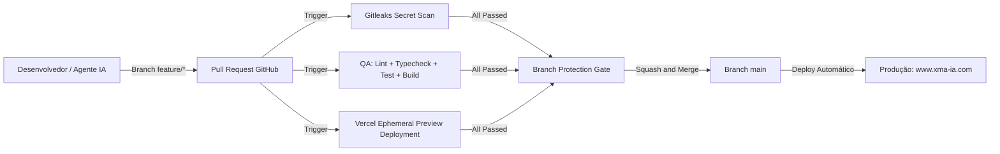

# Guia de Engenharia e Operação para Agentes de IA & Desenvolvedores (AGENTS.md)

> **Padrão de Governança:** ISO/IEC 42001:2023 (Gestão de IA), ISO/IEC 5338:2023 (Ciclo de Vida de Software com IA), ISO/IEC 25010:2023 (Qualidade de Software) e ISO/IEC 27001:2022 (Segurança da Informação).  
> **Repositório:** `ivandirfilho/Site-Xma-ia`  
> **Domínio de Produção:** `https://www.xma-ia.com`  
> **Hospedagem:** Vercel Edge Network (`site-xma-ia.vercel.app`)

---

## 1. Visão Geral e Contexto do Projeto

O **Site XMA.IA** é a plataforma institucional da primeira solução AI-Native para Manutenção Autônoma Industrial e Cognição Neural Edge.  
O site é construído em Next.js com App Router, TypeScript, Ant Design e TailwindCSS, fornecendo suporte multilíngue (pt-BR e en-US) e visualizações interativas de telemetria.

---

## 2. Stack Tecnológica e Versões Oficiais

| Componente | Tecnologia / Versão | Função / Observação |
| :--- | :--- | :--- |
| **Framework** | Next.js `^16.1.1` (Turbopack) | App Router híbrido (Server e Client Components) |
| **Biblioteca UI** | React / React-DOM `^18.2.0` | Base de componentes |
| **Tipagem** | TypeScript `^5.3.3` | Tipagem estrita (`strict: true` em `tsconfig.json`) |
| **Design System** | Ant Design (`antd`) `^5.12.5` | Suportado por `@ant-design/icons` e `@ant-design/cssinjs` |
| **CSS Utilitário** | TailwindCSS `^3.4.0` | Estilização responsiva e grid layouts |
| **Linter** | ESLint `^9.39.5` (Flat Config) | Configurado em `eslint.config.mjs` com parser TS |
| **Test Runner** | Node.js Test Runner + `tsx` `^4.23.15` | Execução nativa ultrarrápida via `node:test` e `node:assert` |
| **CI/CD** | GitHub Actions | Workflows de segurança (Gitleaks) e qualidade (ISO 25010) |
| **Hospedagem & Edge** | Vercel Edge Network | Deploys de produção e Preview Environments efêmeros por PR |

---

## 3. Comandos Padronizados do Ciclo de Vida

Todo agente ou desenvolvedor deve obrigatoriamente utilizar os comandos oficiais abaixo antes de submeter qualquer Pull Request:

```bash
# Instalação determinística de dependências (nunca altere o lockfile sem necessidade)
npm ci

# Verificação estática de tipos do TypeScript (obrigatório código de saída 0)
npm run typecheck

# Análise de conformidade e boas práticas do código
npm run lint

# Execução da suíte de testes unitários automatizados (obrigatório 100% de aprovação)
npm test

# Build de produção otimizado (validação de bundling, rotas estáticas e SSR)
npm run build

# Execução em ambiente de desenvolvimento local (porta 3000)
npm run dev
```

---

## 4. Diretrizes Arquiteturais e Padrões de Código

### A. Next.js App Router & SSR
* **Server Components por Padrão:** Páginas como `src/app/page.tsx` e `src/app/layout.tsx` são Server Components.
* **Client Components Explícitos:** Qualquer componente que use hooks do React (`useState`, `useEffect`, `useContext`) deve incluir a diretiva `'use client'` no topo do arquivo.
* **Ant Design CSS-in-JS no SSR:** Todo componente Ant Design deve ser renderizado dentro do wrapper `StyledComponentsRegistry` (`src/lib/AntdRegistry.tsx`) configurado no `layout.tsx` para evitar *Flash of Unstyled Content* (FOUC).

### B. Sistema de Design e Cores Oficiais
Nunca utilize cores arbitrárias fora da paleta corporativa XMAIA:

```css
--xmaia-primary:   #0066ff;  /* Azul industrial principal */
--xmaia-secondary: #00d4ff;  /* Ciano de destaque / telemetria */
--xmaia-neural:    #00ff88;  /* Verde neural de status operacional */
--xmaia-dark:      #0a0a0f;  /* Background escuro principal */
--xmaia-darker:    #050508;  /* Background de contraste elevado */
--xmaia-accent:    #6366f1;  /* Indigo accent / bordas */
```

### C. Internacionalização (i18n)
* As traduções de interface residem em `src/contexts/LanguageContext.tsx`.
* Ao adicionar novos textos ou telas, adicione obrigatoriamente as chaves nos dicionários `pt-BR` e `en-US`.
* O dicionário `translations` é exportado para permitir validação estática de integridade.
* Consuma as traduções através do hook `useLanguage()`.

### D. SEO Estrutural e Metadados Canônicos
* **Sitemap XML (`src/app/sitemap.ts`):** Gera automaticamente `/sitemap.xml` no App Router com frequências de alteração e prioridades de indexação.
* **Robots TXT (`src/app/robots.ts`):** Gera automaticamente `/robots.txt` orientando crawlers e bloqueando rotas internas (`/api/`).

### E. Suíte de Testes Automatizados
* Reside no diretório `tests/`.
* `tests/i18n.test.ts` valida a simetria estrita entre dicionários `pt-BR` e `en-US`, ausência de valores vazios e integridade de chaves de navegação.

---

## 5. Pipeline de CI/CD e Gestão de Ambientes (ISO 27001 & ISO 25010)



### A. Pipeline GitHub Actions (`.github/workflows/ci.yml`)
* **`security-scan`:** Executa o scanner Gitleaks em todo o histórico de commits do PR.
* **`quality-gate`:** Executa sequencialmente `npm ci`, `npm run lint`, `npm run typecheck`, `npm test` e `npm run build`.

### B. Ambientes de Homologação Efêmeros (Vercel Previews)
* Todo PR aberto contra a branch `main` gera uma URL única de Preview (`https://site-xma-ia-git-*.vercel.app`).
* Permite validação visual e homologação isolada sem afetar a produção oficial.

### C. Branch Protection Rules (`main`)
* Pushes diretos e force-pushes na branch `main` estão bloqueados.
* Exige que os status checks `Quality Assurance & Build (ISO 25010)` e `Secret Scanning & Security (ISO 27001)` passem antes de qualquer liberação de merge.

---

## 6. Protocolo de Governança para Agentes (ISO 42001 & ISO 5338)

Quando um agente de IA estiver executando tarefas neste repositório, ele deve seguir os seguintes guardrails:

1. **Nunca realizar pushes diretos na branch `main`:** Todas as alterações devem ser originadas de branches `feature/<nome>` ou `fix/<nome>` e submetidas via Pull Request.
2. **Template de Pull Request Obrigatório:** Utilize o template padronizado em `.github/pull_request_template.md` preenchendo o modelo executor, a justificativa e os checklists normativos.
3. **Conventional Commits:** Os commits devem seguir o padrão:
   - `feat(escopo): descrição concisa`
   - `fix(escopo): correção concisa`
   - `chore(escopo): manutenção técnica`
4. **Validação Pré-Merge Obrigatória:** O agente só deve submeter ou mergear seu Pull Request após certificar que:
   - `npm run typecheck` retornou 0 erros.
   - `npm run lint` retornou 0 erros.
   - `npm test` executou todos os testes com 100% de sucesso.
   - `npm run build` gerou o bundle de produção sem erros de SSR.
   - O comando `graphify update .` foi executado para atualizar a topologia do grafo de dependências.

---

## 7. Segurança e Proteção de Segredos (ISO 27001)

* É estritamente proibido hardcodar senhas, chaves de API ou tokens de acesso em qualquer arquivo de código-fonte.
* Todas as variáveis sensíveis devem ser injetadas exclusivamente através das **Environment Variables** no dashboard da Vercel para os ambientes correspondentes (`Development`, `Preview`, `Production`).
* O repositório conta com varredura contínua de credenciais via Gitleaks no GitHub Actions.

---

## 8. Histórico de Evolução & Sprints Concluídas

* **Sprint 0 — Sanidade do Baseline e Resolução de Erros Ocultos:**
  - Reconstituição do `node_modules` com `npm ci`.
  - Correção de sintaxe TypeScript no [Header.tsx](file:///c:/Users/Windows/Desktop/Site%20Xmaia/Site-Xma-ia/src/components/Layout/Header.tsx).
  - Configuração do Flat Config nativo do ESLint 9 ([eslint.config.mjs](file:///c:/Users/Windows/Desktop/Site%20Xmaia/Site-Xma-ia/eslint.config.mjs)) compatível com Next.js 16 Turbopack.
  - Adição do script `typecheck` e rastreamento do [Dockerfile](file:///c:/Users/Windows/Desktop/Site%20Xmaia/Site-Xma-ia/Dockerfile) e [AccessRequestModal.tsx](file:///c:/Users/Windows/Desktop/Site%20Xmaia/Site-Xma-ia/src/components/AccessRequest/AccessRequestModal.tsx).
* **Sprint 1 — Governança de Agentes, Context Anchoring & Pipeline CI:**
  - Criação do `AGENTS.md` e `.github/pull_request_template.md` (ISO 42001/5338).
  - Implementação do pipeline de CI automatizado ([.github/workflows/ci.yml](file:///c:/Users/Windows/Desktop/Site%20Xmaia/Site-Xma-ia/.github/workflows/ci.yml)) com Gitleaks e Quality Gate.
  - Abertura do Pull Request #1.
* **Sprint 2 — Proteção de Branch e Homologação via Vercel Previews:**
  - Configuração das Branch Protection Rules na branch `main` via GitHub API (`strict: true`).
  - Validação de deploys efêmeros de homologação da Vercel por PR.
  - Merge do PR #1 via Squash and Merge.
* **Sprint 3 — SEO Estrutural e Testes Automatizados:**
  - Criação de [src/app/sitemap.ts](file:///c:/Users/Windows/Desktop/Site%20Xmaia/Site-Xma-ia/src/app/sitemap.ts) (`/sitemap.xml`) e [src/app/robots.ts](file:///c:/Users/Windows/Desktop/Site%20Xmaia/Site-Xma-ia/src/app/robots.ts) (`/robots.txt`).
  - Implementação da suíte de testes unitários ultrarrápida com `tsx` e `node:test` ([tests/i18n.test.ts](file:///c:/Users/Windows/Desktop/Site%20Xmaia/Site-Xma-ia/tests/i18n.test.ts)).
  - Integração do step `npm test` no workflow de CI.
  - Abertura, validação e merge do Pull Request #2.
