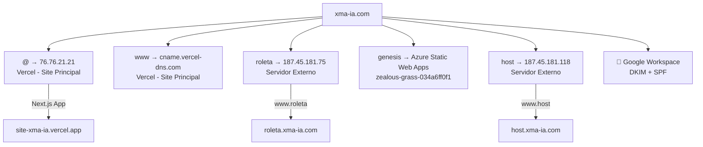
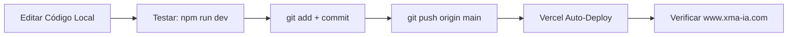
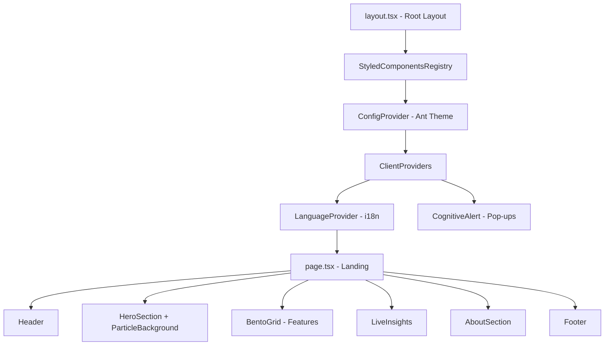

# 🏗️ INFRAESTRUTURA COMPLETA — SITE XMA.IA

> **Documento de Referência para Agentes IA**
> **Última atualização**: 2026-05-02
> **Propósito**: Instruir agentes IA a criar subdomínios, fazer uploads e gerenciar o site
> **Screenshots de referência**: `instrucoes/Captura de tela 2026-05-02 101915.png` e `instrucoes/Captura de tela 2026-05-02 102011.png`

---

## 1. 📋 VISÃO GERAL DO PROJETO

| Campo | Valor |
|:------|:------|
| **Nome do Projeto** | `xmaia-landing` (Vercel: `site-xma-ia`) |
| **Tipo** | Landing Page / Site Institucional |
| **Propósito** | Plataforma de Manutenção Autônoma AI-Native para indústria |
| **Status Atual** | ✅ LIVE em produção (🟢 Ready) |
| **Domínio Principal** | **https://www.xma-ia.com** |
| **URL Vercel** | https://site-xma-ia.vercel.app |
| **Deployment URL** | `site-xma-fisjfqxmh-ivandirs-projects.vercel.app` |
| **Data de Criação** | 29/12/2025 |
| **Criado por** | `ivandirfilho` |
| **Conta Vercel** | `ivandirs-projects` |
| **Idiomas** | pt-BR (padrão) e en-US |
| **Versão** | 0.1.0 |

---

## 2. 🔧 STACK TECNOLÓGICA

### Framework & Runtime

| Tecnologia | Versão | Função |
|:-----------|:-------|:-------|
| **Next.js** | ^16.1.1 | Framework React (App Router) |
| **React** | ^18.2.0 | Biblioteca UI |
| **TypeScript** | ^5.3.3 | Tipagem estática |
| **Node.js** | 20 (Alpine) | Runtime (Dockerfile) |

### UI & Estilização

| Tecnologia | Versão | Função |
|:-----------|:-------|:-------|
| **Ant Design** | ^5.12.5 | Component library (botões, forms, layout) |
| **@ant-design/icons** | ^5.2.6 | Ícones |
| **@ant-design/cssinjs** | ^1.18.1 | CSS-in-JS para Ant Design |
| **TailwindCSS** | ^3.4.0 | Utility-first CSS |
| **PostCSS** | ^8.4.32 | Processador CSS |
| **Autoprefixer** | ^10.4.16 | Prefixos de compatibilidade |

### Fontes

- **Google Fonts**: Inter (weights: 300, 400, 500, 600, 700, 800)
- Carregada via `<link>` no `layout.tsx`

### Design System — Cores XMAIA

```css
--xmaia-primary: #0066ff;    /* Azul principal */
--xmaia-secondary: #00d4ff;  /* Ciano */
--xmaia-neural: #00ff88;     /* Verde neural */
--xmaia-dark: #0a0a0f;       /* Fundo escuro */
--xmaia-darker: #050508;     /* Fundo mais escuro */
--xmaia-accent: #6366f1;     /* Indigo accent */
```

---

## 3. 📁 ESTRUTURA DE DIRETÓRIOS

```
Site-Xma-ia/
├── public/
│   └── xmaia-logo.png              # Logo principal
├── src/
│   ├── app/
│   │   ├── globals.css              # CSS global + animações
│   │   ├── layout.tsx               # Root layout (metadata, SEO, providers)
│   │   ├── page.tsx                 # Página principal (landing)
│   │   └── login/
│   │       └── page.tsx             # Página de login (visual only)
│   ├── components/
│   │   ├── About/AboutSection.tsx
│   │   ├── AccessRequest/AccessRequestModal.tsx
│   │   ├── ClientProviders.tsx
│   │   ├── CognitiveAlert/CognitiveAlert.tsx
│   │   ├── CognitiveDashboard/CognitiveDashboard.tsx
│   │   ├── Features/BentoGrid.tsx
│   │   ├── Hero/
│   │   │   ├── HeroSection.tsx
│   │   │   └── ParticleBackground.tsx
│   │   ├── LanguageSwitcher/LanguageSwitcher.tsx
│   │   ├── Layout/
│   │   │   ├── Header.tsx
│   │   │   └── Footer.tsx
│   │   └── LiveInsights/LiveInsights.tsx
│   ├── contexts/
│   │   └── LanguageContext.tsx       # i18n (traduções inline pt-BR/en-US)
│   ├── lib/
│   │   └── AntdRegistry.tsx
│   └── theme/
│       └── antConfig.ts
├── instrucoes/                       # Documentação de infraestrutura
├── Dockerfile                        # Docker config (dev mode)
├── next.config.js
├── tailwind.config.ts
├── postcss.config.js
├── tsconfig.json
└── package.json
```

### Rotas Existentes

| Rota | Arquivo | Descrição |
|:-----|:--------|:----------|
| `/` | `src/app/page.tsx` | Landing page principal |
| `/login` | `src/app/login/page.tsx` | Página de login (visual, sem backend) |

---

## 4. 🚀 DEPLOY & HOSTING

### Plataforma: Vercel

| Campo | Valor |
|:------|:------|
| **Provedor** | Vercel (Free Tier) |
| **Conta** | `ivandirs-projects` |
| **Projeto** | `site-xma-ia` |
| **URL Vercel** | https://site-xma-ia.vercel.app |
| **Domínio Custom** | https://www.xma-ia.com |
| **Deployment URL** | `site-xma-fisjfqxmh-ivandirs-projects.vercel.app` |
| **Método de Deploy** | Auto-deploy via integração GitHub → branch `main` |
| **Build Command** | `next build` (padrão Vercel) |
| **Último Commit Live** | `f7c560a` — "fix: add language switcher to mobile menu drawer" |
| **vercel.json** | ❌ Não existe (usa configuração padrão) |

### Métricas de Saúde (Vercel Dashboard)

| Métrica | Valor |
|:--------|:------|
| **Status** | 🟢 Ready |
| **Firewall** | ✅ Active — All systems normal |
| **Edge Requests (6h)** | 233 |
| **Function Invocations** | 0 |
| **Error Rate** | 0% |
| **Analytics Vercel** | ❌ Não habilitado (disponível para ativar) |
| **Deployment Settings** | 3 recomendações pendentes |

### Como funciona o deploy

1. Push para branch `main` no GitHub
2. Vercel detecta automaticamente o push
3. Executa `npm install` + `next build`
4. Deploy automático em ~60-90 segundos
5. URL de preview é gerada para cada commit

### Docker (Alternativo)

```dockerfile
FROM node:20-alpine
WORKDIR /app
COPY package.json package-lock.json* ./
RUN npm ci
COPY . .
EXPOSE 3000
CMD ["npm", "run", "dev"]
```

> ⚠️ Este Dockerfile roda `npm run dev` (desenvolvimento). Para produção, alterar para `npm run build && npm start`.

---

## 5. 📦 REPOSITÓRIO GIT

| Campo | Valor |
|:------|:------|
| **Plataforma** | GitHub |
| **URL** | https://github.com/ivandirfilho/Site-Xma-ia |
| **Owner** | `ivandirfilho` |
| **Visibilidade** | Público |
| **Branch Principal** | `main` |
| **Total de Commits** | 4 |
| **Linguagens** | TypeScript (97.8%), CSS (2.0%), JavaScript (0.2%) |

### Histórico de Commits

```
f7c560a  fix: add language switcher to mobile menu drawer       (LIVE)
64b8f76  fix: add i18n and mobile responsiveness to CognitiveAlert and CognitiveDashboard
863340b  fix: resolve i18n missing keys and mobile responsiveness issues
20af568  Initial commit - XMA.IA Landing Page
```

### Arquivos Não Commitados (pendentes)

```
 M src/components/CognitiveDashboard/CognitiveDashboard.tsx
 M src/components/Layout/Header.tsx
?? Dockerfile
?? src/components/AccessRequest/
```

> ⚠️ O site live pode estar desatualizado em relação ao código local.

---

## 6. 🔑 CREDENCIAIS E ACESSOS

### ⚠️ INFORMAÇÕES SENSÍVEIS — PROTEGER

| Serviço | Tipo de Acesso | Usuário/Conta | Observações |
|:--------|:---------------|:--------------|:------------|
| **GitHub** | Repositório | `ivandirfilho` | Owner do repo. Acesso total ao código |
| **Vercel** | Deploy & Hosting | `ivandirs-projects` (via GitHub OAuth) | Projeto: `site-xma-ia` |
| **Google Domains** | DNS do domínio `xma-ia.com` | Conta Google vinculada | Gerencia todos os registros DNS |
| **Google Workspace** | E-mail corporativo `@xma-ia.com` | Conta Google vinculada | DKIM + SPF configurados |
| **Azure Static Web Apps** | Subdomínio `genesis` | Conta Azure | App: `zealous-grass-034a6ff0f1` |
| **Servidor Externo** | IPs `187.45.181.75` / `.118` | — | Hospeda `roleta` e `host` |
| **Arquivo .env** | ❌ NÃO EXISTE | — | Nenhuma variável de ambiente configurada |

### Senhas Hardcoded no Código

**NENHUMA senha ou credencial encontrada no código-fonte.**

> 🔴 **AÇÃO NECESSÁRIA**: Para credenciais futuras:
> 1. Criar `.env.local` na raiz (já está no `.gitignore`)
> 2. Adicionar variáveis no painel Vercel: Settings → Environment Variables
> 3. NUNCA commitar credenciais no código

---

## 7. 🌐 DOMÍNIO E DNS — CONFIGURAÇÃO COMPLETA

### Domínio Principal

| Campo | Valor |
|:------|:------|
| **Domínio** | `xma-ia.com` |
| **Registrador/DNS** | Google Domains (migrado para Squarespace Domains) |
| **Site Principal** | `www.xma-ia.com` → Vercel |
| **SSL/HTTPS** | ✅ Automático pela Vercel |
| **CDN** | ✅ Vercel Edge Network (global) |
| **E-mail** | ✅ Google Workspace (`@xma-ia.com`) |

> ⚠️ O domínio `xmaia.com.br` **NÃO pertence a este projeto** (é um estúdio de móveis em BH).

### Tabela Completa de Registros DNS

| Tipo | Nome | TTL | Dados | Finalidade |
|:-----|:-----|:----|:------|:-----------|
| **A** | `@` (raiz) | 30 min | `76.76.21.21` | 🟢 Aponta raiz para **Vercel** |
| **CNAME** | `www` | 30 min | `cname.vercel-dns.com` | 🟢 Alias www para **Vercel** |
| **A** | `roleta` | 30 min | `187.45.181.75` | 🔵 Subdomínio **roleta.xma-ia.com** → servidor externo |
| **CNAME** | `www.roleta` | 30 min | `roleta.xma-ia.com` | 🔵 Alias www do subdomínio roleta |
| **CNAME** | `genesis` | 30 min | `zealous-grass-034a6ff0f1.azurestaticapps.net` | 🟣 Subdomínio **genesis.xma-ia.com** → Azure Static Web Apps |
| **A** | `host` | 30 min | `187.45.181.118` | 🔵 Subdomínio **host.xma-ia.com** → servidor externo |
| **A** | `www.host` | 4 horas | `187.45.181.118` | 🔵 Alias www do subdomínio host |
| **TXT** | `google._domainkey` | 1 hora | `v=DKIM1; k=rsa; p=MIIBIjANBgkqhkiG9w0BAQEFA...` | 📧 DKIM para Google Workspace |
| **TXT** | `@` | 1 hora | `v=spf1 include:_spf.google.com ~all` | 📧 SPF para Google Workspace |

### Mapa Visual de Subdomínios



### Subdomínios Ativos

| Subdomínio | URL Completa | Destino | Infraestrutura |
|:-----------|:-------------|:--------|:---------------|
| `www` | `www.xma-ia.com` | Vercel (site principal) | Next.js + Vercel |
| `roleta` | `roleta.xma-ia.com` | IP `187.45.181.75` | Servidor externo |
| `genesis` | `genesis.xma-ia.com` | Azure Static Web Apps | Azure |
| `host` | `host.xma-ia.com` | IP `187.45.181.118` | Servidor externo |

---

## 8. 📢 PUBLICIDADE E ANALYTICS

### Estado Atual

| Serviço | Status |
|:--------|:-------|
| **Google Analytics** | ❌ Não configurado |
| **Vercel Analytics** | ❌ Disponível mas não habilitado |
| **Google Ads** | ❌ Não configurado |
| **Google Tag Manager** | ❌ Não configurado |
| **Facebook Pixel** | ❌ Não configurado |
| **SEO/Sitemap** | ⚠️ Metadata OK, mas sem `sitemap.xml` ou `robots.txt` |

### SEO Configurado (em `layout.tsx`)

```typescript
metadata = {
    title: 'xma.ia | Manutenção Autônoma AI-Native | Neural Edge Industrial',
    description: 'A primeira plataforma AI-Native...',
    keywords: 'manutenção autônoma, AI industrial, machine learning...',
    openGraph: { ... },  // ✅ Configurado
    twitter: { ... },     // ✅ Configurado
    robots: { index: true, follow: true }  // ✅ Indexável
};
```

### E-mail Corporativo

- **Provedor**: Google Workspace
- **Domínio**: `@xma-ia.com`
- **DKIM**: ✅ Configurado (`google._domainkey`)
- **SPF**: ✅ Configurado (`v=spf1 include:_spf.google.com ~all`)

---

## 9. 🔄 CICLO DE MANUTENÇÃO

### Estado Atual

| Aspecto | Status | Detalhes |
|:--------|:-------|:---------|
| **Testes Automatizados** | ❌ | Nenhum teste unitário/e2e |
| **Linting** | ⚠️ Parcial | Script `next lint` existe mas sem `.eslintrc` |
| **CI/CD** | ❌ | Sem GitHub Actions |
| **Monitoramento** | ⚠️ | Vercel Observability ativo (Edge Requests, Error Rate) |
| **Firewall** | ✅ | Vercel Firewall ativa — All systems normal |
| **Backup** | ⚠️ | Apenas via Git (código). Sem dados para backup |

### Fluxo de Trabalho



### Comandos Essenciais

```bash
npm run dev          # Servidor dev em localhost:3000
npm run build        # Build otimizado
npm start            # Serve o build local
npm run lint         # Verifica código
git push origin main # Deploy automático Vercel
```

---

## 10. 🏛️ ARQUITETURA DOS COMPONENTES

### Fluxo de Renderização



### Padrões Utilizados

- **Server Components**: `layout.tsx` e `page.tsx`
- **Client Components**: Todos os interativos usam `'use client'`
- **Dynamic Import**: `CognitiveAlert` com `dynamic()` e `ssr: false`
- **i18n**: Traduções inline em `LanguageContext.tsx`
- **Estilização**: Ant Design inline styles + TailwindCSS + CSS global

---

## 11. 📝 GUIA COMPLETO PARA CRIAR SUBDOMÍNIOS

> **CONTEXTO**: O domínio `xma-ia.com` já possui 3 subdomínios ativos (roleta, genesis, host). O DNS é gerenciado no Google Domains/Squarespace.

### Passo-a-passo para NOVO subdomínio apontando para Vercel

Exemplo: criar `app.xma-ia.com` com um novo projeto Next.js

```bash
# 1. Criar novo projeto
npx -y create-next-app@latest ./novo-projeto --typescript --tailwind --app --no-src-dir

# 2. Inicializar Git e subir para GitHub
cd novo-projeto
git init
git remote add origin https://github.com/ivandirfilho/novo-projeto.git
git push -u origin main

# 3. No painel Vercel (https://vercel.com):
#    - Import Project → Selecionar repo "novo-projeto"
#    - Settings → Domains → Adicionar "app.xma-ia.com"

# 4. No painel DNS do Google Domains (https://domains.google.com):
#    - Registros personalizados → ADICIONAR REGISTRO
#    - Tipo: CNAME
#    - Nome: app
#    - TTL: 30 minutos
#    - Dados: cname.vercel-dns.com
```

### Passo-a-passo para subdomínio apontando para Azure Static Web Apps

Exemplo: criar `painel.xma-ia.com` (como foi feito com `genesis`)

```bash
# 1. Criar Azure Static Web App via portal ou CLI
az staticwebapp create --name painel-xmaia --resource-group XMAIA-RG

# 2. No painel DNS do Google Domains:
#    - Tipo: CNAME
#    - Nome: painel
#    - TTL: 30 minutos
#    - Dados: <nome-gerado>.azurestaticapps.net

# 3. No Azure Portal:
#    - Static Web App → Custom Domains → Add
#    - Inserir: painel.xma-ia.com
#    - Validação via CNAME automática
```

### Passo-a-passo para subdomínio apontando para IP (servidor externo)

Exemplo: como foi feito com `roleta` (IP `187.45.181.75`)

```bash
# No painel DNS do Google Domains:
# - Tipo: A
# - Nome: novoservico
# - TTL: 30 minutos
# - Dados: <IP-DO-SERVIDOR>
#
# Para adicionar alias www:
# - Tipo: CNAME
# - Nome: www.novoservico
# - TTL: 30 minutos
# - Dados: novoservico.xma-ia.com
```

### Passo-a-passo para rota interna (sem subdomínio real)

Para seções dentro do mesmo site Next.js:

```bash
# 1. Criar rota
mkdir -p src/app/nova-secao
touch src/app/nova-secao/page.tsx

# 2. Acessível em: www.xma-ia.com/nova-secao
# 3. Não precisa mexer no DNS
```

### Middleware Multi-Tenant (subdomínios no mesmo projeto)

```typescript
// middleware.ts (na raiz do projeto)
import { NextRequest, NextResponse } from 'next/server';

export function middleware(request: NextRequest) {
    const hostname = request.headers.get('host') || '';
    const subdomain = hostname.split('.')[0];

    // Redireciona subdomínios para rotas internas
    if (subdomain === 'docs') {
        return NextResponse.rewrite(new URL('/docs' + request.nextUrl.pathname, request.url));
    }
    if (subdomain === 'app') {
        return NextResponse.rewrite(new URL('/app' + request.nextUrl.pathname, request.url));
    }
}

export const config = {
    matcher: ['/((?!api|_next/static|_next/image|favicon.ico).*)'],
};
```

---

## 12. 📤 GUIA PARA UPLOADS DE CONTEÚDO

### Imagens e Assets Estáticos

```bash
# Colocar em public/ → acessível via /nome.ext
cp nova-imagem.png public/nova-imagem.png
git add public/nova-imagem.png
git commit -m "feat: add nova imagem"
git push origin main
# Deploy automático → disponível em www.xma-ia.com/nova-imagem.png
```

### Next.js Image (otimizado)

```tsx
import Image from 'next/image';

<Image src="/nova-imagem.png" alt="Descrição" width={800} height={600} priority />
```

### Novas Páginas

1. Criar `src/app/nome-pagina/page.tsx`
2. Importar componentes existentes
3. Adicionar link no `Header.tsx` e traduções no `LanguageContext.tsx`

### Novos Componentes

1. Criar `src/components/NomeComponente/NomeComponente.tsx`
2. Usar `'use client'` se interativo
3. Importar `useLanguage` para i18n
4. Adicionar traduções pt-BR e en-US em `LanguageContext.tsx`

---

## 13. ⚠️ PROBLEMAS CONHECIDOS

| # | Problema | Severidade | Ação |
|:-:|:---------|:-----------|:-----|
| 1 | Login apenas visual | 🟡 | Implementar backend |
| 2 | Sem .env configurado | 🟡 | Criar quando necessário |
| 3 | Dados hardcoded/demo | 🟡 | Conectar API real |
| 4 | Sem testes | 🔴 | Adicionar Jest + Testing Library |
| 5 | Sem sitemap.xml/robots.txt | 🟡 | Criar para SEO |
| 6 | Sem analytics ativo | 🟡 | Habilitar Vercel Analytics ou GA4 |
| 7 | Arquivos não commitados | 🔴 | Commitar Dockerfile e AccessRequest |
| 8 | Dockerfile em dev mode | 🟡 | Alterar para build + start |
| 9 | Sem error boundaries | 🟡 | Adicionar error.tsx |
| 10 | 3 recomendações Vercel pendentes | 🟡 | Verificar Deployment Settings |

---

## 14. 🗺️ REFERÊNCIA RÁPIDA PARA AGENTES IA

### Checklist de modificação

- [ ] Clone: `git clone https://github.com/ivandirfilho/Site-Xma-ia`
- [ ] Instale: `npm install`
- [ ] Rode local: `npm run dev` (porta 3000)
- [ ] Edite os arquivos necessários
- [ ] Teste localmente
- [ ] Commit: `git add . && git commit -m "mensagem"`
- [ ] Push: `git push origin main`
- [ ] Verifique deploy em https://www.xma-ia.com

### Mapa de responsabilidades

| O que mudar | Onde editar |
|:------------|:-----------|
| Textos/traduções | `src/contexts/LanguageContext.tsx` |
| Cores/tema | `tailwind.config.ts` + `globals.css` + `antConfig.ts` |
| Logo | `public/xmaia-logo.png` |
| SEO/metadata | `src/app/layout.tsx` |
| Menu/navegação | `src/components/Layout/Header.tsx` |
| Parceiros/footer | `src/components/Layout/Footer.tsx` |
| Hero section | `src/components/Hero/HeroSection.tsx` |
| Features grid | `src/components/Features/BentoGrid.tsx` |
| Nova página | Criar `src/app/[nome]/page.tsx` |
| Novo subdomínio (Vercel) | DNS: CNAME → `cname.vercel-dns.com` + Vercel Domains |
| Novo subdomínio (Azure) | DNS: CNAME → `<app>.azurestaticapps.net` |
| Novo subdomínio (IP) | DNS: A → `<IP>` |
| DNS | Google Domains → Registros personalizados |
| Deploy config | Painel Vercel (web) → `ivandirs-projects` |

### Acessos necessários para operação completa

| Operação | Acesso necessário |
|:---------|:-----------------|
| Editar código | GitHub (`ivandirfilho`) |
| Deploy | Vercel (`ivandirs-projects`) — automático via GitHub |
| Criar subdomínio | Google Domains (painel DNS) + Vercel/Azure/Servidor |
| Configurar e-mail | Google Workspace (`@xma-ia.com`) |
| Gerenciar Azure apps | Azure Portal (conta com `genesis`) |
| Gerenciar servidores | Acesso SSH/painel aos IPs `187.45.181.75` / `187.45.181.118` |

---

*Documento gerado em 2026-05-02 por análise automatizada do codebase + screenshots do painel Vercel e DNS.*
*Repositório: https://github.com/ivandirfilho/Site-Xma-ia*
*Domínio: https://www.xma-ia.com*
